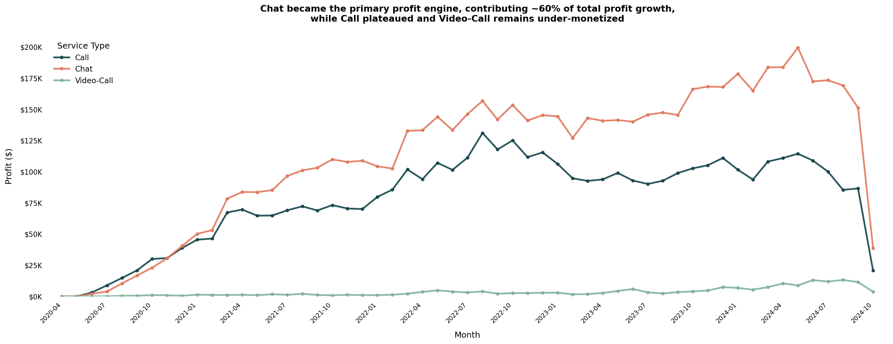
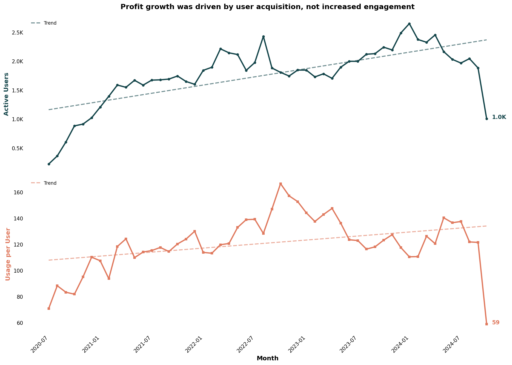
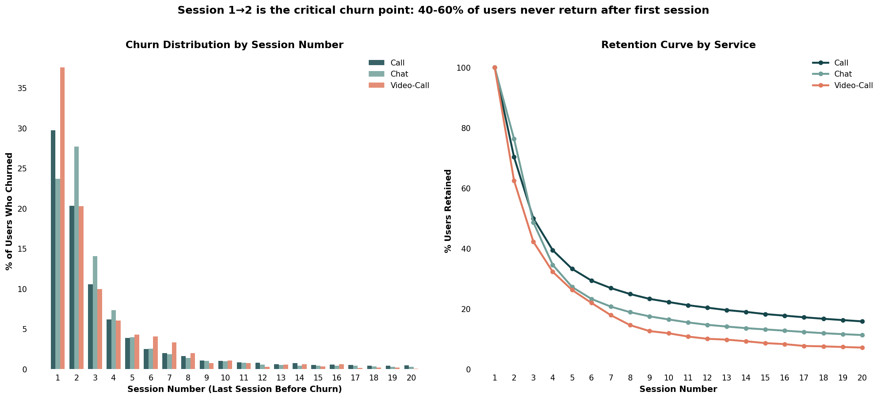
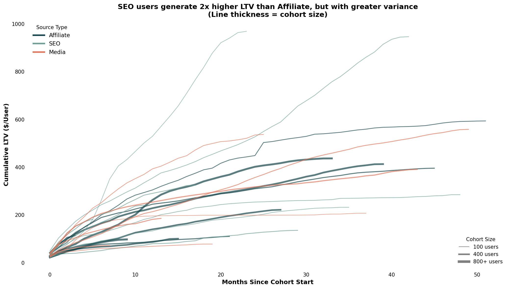
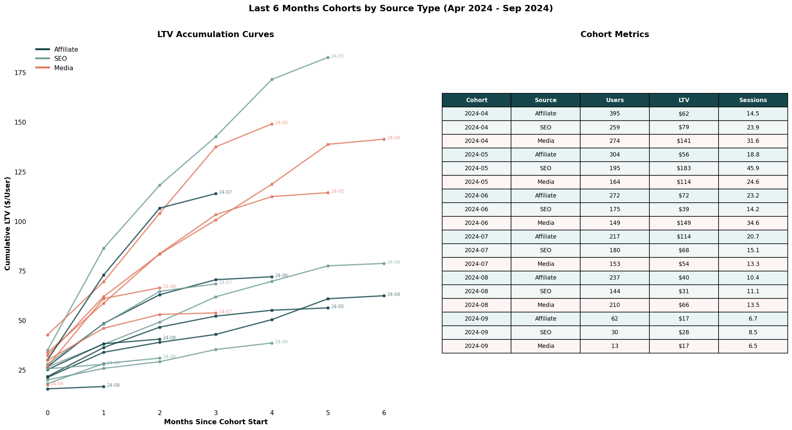
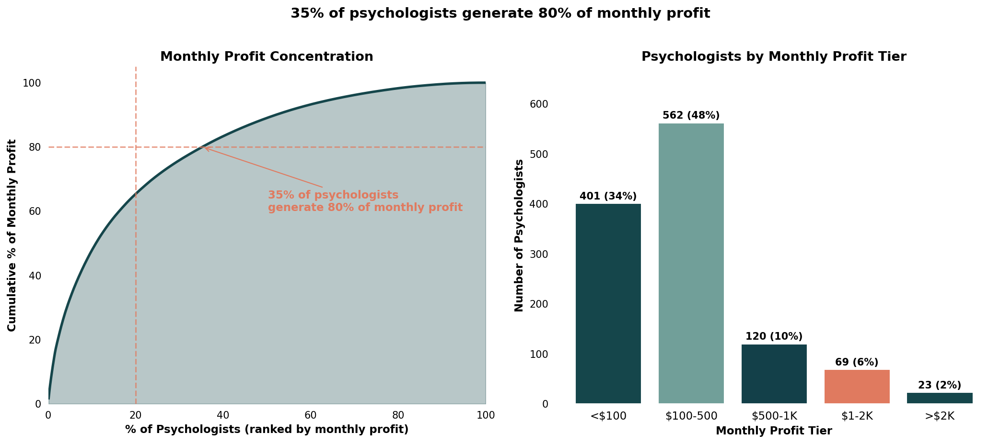

# Online Psychological Health Service Analysis

A comprehensive data analysis of a subscription-based digital psychological health service, examining growth patterns, user retention, channel performance, and supply-side economics.

**Dataset:** 2.4M transactions | **Time Period:** 2020-2024 | **Users:** 36K+ | **Providers:** 1,178

---

## Executive Summary

This analysis reveals key insights about the business:

1. **Chat drives growth** — 60% of profit growth came from Chat, primarily through user acquisition (20x growth), not increased engagement
2. **Critical churn point** — 40-60% of users never return after their first session across all service types
3. **SEO brings quality, Affiliate brings scale** — SEO users generate 2x higher LTV but with greater variance
4. **Supply concentration risk** — 35% of psychologists generate 80% of monthly profit

---

## 1. Revenue Analysis

### REVENUE GROWTH: Chat Became the Primary Profit Engine



**What the chart shows:**
Monthly profit trend from 2020-2024 across three service types: Call (dark teal), Chat (coral), and Video-Call (light teal). Y-axis represents monthly profit in dollars, X-axis shows time.

**Trend over time:**
- **Chat** increased steadily from near $0 (2020) to ~$175K/month (2024), representing exponential growth
- **Call** grew from $0 to ~$75K/month by early 2021, then plateaued and remained stable at $100-115K through 2024
- **Video-Call** remained flat near $0 throughout the entire period, showing minimal monetization

**Business interpretation:**
Chat became the dominant revenue driver, contributing approximately 60% of total profit growth. Call reached maturity around mid-2021 and has shown no meaningful growth since. Video-Call remains under-monetized despite being available throughout the period, suggesting either low demand, poor product-market fit, or lack of investment.

**Strategic implication:**
Future revenue growth is dependent on Chat's continued expansion. Call represents a stable but non-growing revenue base. Video-Call requires strategic decision: invest to grow or deprecate.

---

## 2. Growth Decomposition

### GROWTH DRIVERS: Chat's Profit Growth Was Driven by User Acquisition (20x), Not Engagement



**What the chart shows:**
Two-panel analysis showing Active Users (top) and Usage per User (bottom) by service type from 2020-2024. This decomposes profit growth into acquisition vs. engagement components.

**Trend over time:**

*Upper panel (Active Users):*
- **Chat** showed dramatic growth from ~100 users (2020) to 2,000+ users (2024) — approximately 20x increase
- **Call** remained stable at 600-800 users throughout, showing no meaningful user acquisition growth
- **Video-Call** stayed flat near 0-50 users

*Lower panel (Usage per User):*
- **Call** maintained highest engagement at 100-130 usage units per user
- **Chat** started lower (~40) but increased steadily to ~100-110, converging with Call
- **Video-Call** showed high volatility but gradual improvement from ~15 to ~50-90

**Business interpretation:**
Chat's revenue dominance is entirely acquisition-driven — the 20x user growth explains the profit growth. Engagement (usage per user) grew modestly but similarly across Call and Chat. Call users are actually more engaged per person, but the user base isn't expanding. This indicates Chat has better top-of-funnel performance while Call may have a user acquisition problem.

**Strategic implication:**
The growth model is acquisition-dependent. If user acquisition slows (as seen in late 2024), profit growth will stall. Investment in retention and engagement could create a more sustainable growth model.

---

## 3. Retention Analysis

### RETENTION: Session 1→2 is the Critical Churn Point — 40-60% Never Return



**What the chart shows:**
Two-panel analysis: Left panel shows churn distribution by session number (% of users whose last session was N). Right panel shows retention curves (% of users who reach session N) for each service type.

**Trend over time:**

*Left panel (Churn Distribution):*
- **Video-Call** has highest first-session churn at 37.5%
- **Call** shows 29.7% first-session churn, 20.3% second-session churn (50% cumulative)
- **Chat** uniquely shows higher second-session churn (27.7%) than first-session (23.7%)

*Right panel (Retention Curves):*
- All services show steep initial drop-off, losing 50-60% of users by session 3
- **Call** has best long-term retention — ~15% reach session 20
- **Chat** has weakest long-term retention — ~8% reach session 20
- **Video-Call** has steepest early decline but similar long-term pattern

**Business interpretation:**
The first session is make-or-break for retention. More than half of all users are lost within the first two sessions. Chat's unusual pattern (higher session 2 churn) suggests users try it, return once, then leave — possibly indicating a mismatch between initial expectations and experience.

**Strategic implication:**
Incentives should target the session 1→2 transition for all services. For Chat specifically, a "3rd session" incentive may address the secondary churn spike. Investment in first-session quality and immediate follow-up could significantly improve lifetime value.

---

## 4. Channel Analysis

### CHANNEL PERFORMANCE: SEO Users Generate 2x Higher LTV Than Affiliate



**What the chart shows:**
Cumulative LTV curves by monthly cohort and acquisition source (Affiliate, SEO, Media). X-axis shows months since cohort start, Y-axis shows accumulated profit per user. Line thickness represents cohort size.

**Trend over time:**
- **SEO** cohorts reach highest LTV ceiling ($800-950 at 24 months) but show high variance between cohorts
- **Affiliate** cohorts cluster consistently between $400-600 LTV with thicker lines (larger cohorts)
- **Media** shows similar pattern to Affiliate but slightly lower ceiling ($350-560)

**Business interpretation:**
SEO brings higher-value users but unpredictably — some cohorts perform 2x better than others. Affiliate provides scalable, predictable volume with moderate LTV. The high-LTV SEO cohorts are represented by thinner lines, indicating smaller scale — this performance may not be replicable at higher volume.

**Strategic implication:**
A balanced channel strategy is optimal: use Affiliate for predictable scale and SEO for high-value users. Channel mix optimization should consider that SEO's best cohorts are small, so increasing SEO spend may dilute average quality.

---

## 5. Cohort Performance

### COHORT METRICS: Last 6 Months Performance by Channel



**What the chart shows:**
Combined view of LTV accumulation curves (left) and metrics table (right) for cohorts from April 2024 to September 2024, segmented by acquisition source.

**Trend over time:**
- **SEO May 2024** is the standout cohort — $183 LTV in 5 months with steepest growth curve
- **Media** shows consistent mid-tier performance ($114-$149 LTV range)
- **Affiliate** leads on scale (most users) but LTV ranges widely ($17-$114)
- Recent cohorts (Aug-Sep 2024) show concerning decline in both scale and early LTV

**Business interpretation:**
Early LTV velocity (reaching $50+ by month 2) correlates strongly with final cohort performance. The SEO May cohort's success suggests specific characteristics worth investigating — acquisition source, user demographics, or psychologist matching may have differed. The sharp decline in September acquisition (105 total users vs. 550 in July) signals a potential funnel problem.

**Strategic implication:**
Monitor cohort performance at the 2-month mark as a leading indicator. Investigate the September acquisition decline urgently — this represents a 5x drop that will materially impact future revenue.

---

## 6. Supply Analysis

### SUPPLY CONCENTRATION: 35% of Psychologists Generate 80% of Monthly Profit



**What the chart shows:**
Two-panel analysis of monthly profit distribution across 1,178 active psychologists. Left panel shows Pareto cumulative distribution, right panel shows tier breakdown by monthly earning bands.

**Trend over distribution:**
- The Pareto curve reveals classic power-law concentration — **35% of psychologists generate 80% of monthly profit**
- **401 psychologists (34%)** earn less than $100/month — effectively underutilized
- **562 psychologists (48%)** earn $100-500/month — the "middle tier"
- Only **23 psychologists (2%)** exceed $2K/month

**Business interpretation:**
Revenue depends heavily on a small cohort of high-performing providers. One-third of the supply base is generating negligible revenue, indicating either insufficient demand allocation, poor user-provider matching, or quality/availability issues. The bimodal distribution suggests two distinct provider populations: engaged high-performers and underutilized long-tail.

**Strategic implication:**
Two levers exist for supply-side growth:
1. **Retain top 35%** — These providers are critical; their churn would significantly impact revenue
2. **Activate the <$100 tier** — Moving 100 providers from <$100 to $100-500 tier would add ~$30K monthly capacity

---

## Key Recommendations

| Priority | Action | Expected Impact |
|----------|--------|-----------------|
| **1** | Implement post-session-1 incentive | Reduce 50% first-session churn |
| **2** | Retain top 35% of psychologists | Protect 80% of revenue |
| **3** | Investigate September acquisition drop | Prevent further funnel degradation |
| **4** | Activate underperforming providers | Unlock $30K+ monthly capacity |
| **5** | Optimize Chat engagement | Convert acquisition growth to retention |

---

## Methodology

- **Data Source:** Anonymized transaction data (2.4M records)
- **Time Period:** April 2020 - October 2024
- **Cohort Definition:** Users grouped by first transaction month
- **LTV Calculation:** Cumulative company_earned per user over time
- **Churn Definition:** Last session number before user becomes inactive

---

## Repository Structure

```
├── README.md                    # This file
└── images/                      # All visualization outputs
    ├── monthly_profit_by_service_type.png
    ├── users_vs_usage_story.png
    ├── churn_analysis.png
    ├── cohort_ltv_curves.png
    ├── cohorts_curves_and_table.png
    ├── monthly_profit_per_psychologist.png
    ├── source_type_analysis.png
    └── refund_rate_over_time.png
```

---

*Analysis generated February 2026*

